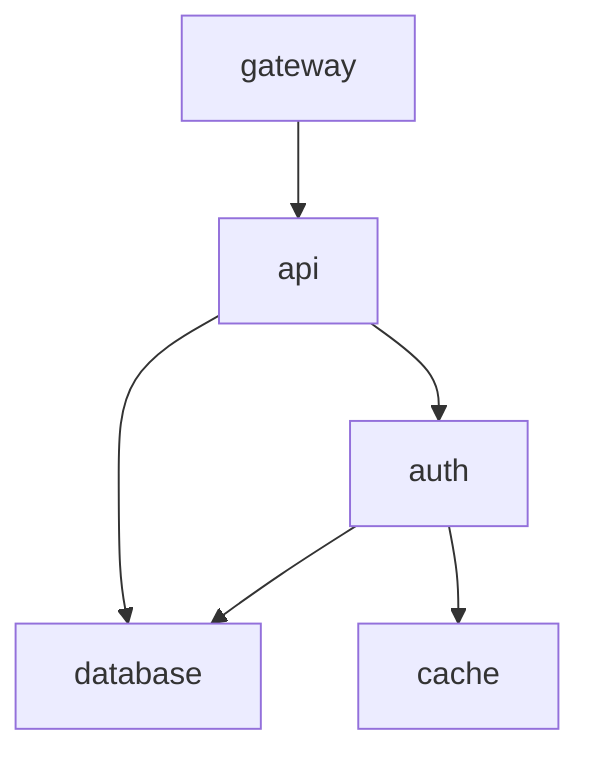

# Change Impact Forecaster

[](https://github.com/ursalaan/change-impact-forecaster/actions/workflows/ci.yml)
[](https://github.com/ursalaan/change-impact-forecaster/actions/workflows/release.yml)

Change Impact Forecaster is a backend service that evaluates the **risk and operational impact of production changes before they are deployed**.

It is designed as a **change-management and SRE decision-support tool**, not an outage prediction system. The focus is on **explainability and auditability**: every score is derived from explicit rules, and every assessment clearly shows *why* a change was classified the way it was.

The goal is simple: surface risk early so teams can make safer deployment decisions before something breaks.

---

## Why this exists

Most production incidents are not mysterious failures. They usually come from **predictable, high-risk changes**, such as:

- deployments made out of hours or on weekends  
- weak or missing rollback plans  
- unclear service dependencies  
- large blast-radius changes deployed in a single step  

These risks are obvious in hindsight but rarely evaluated consistently beforehand.

This project provides a **structured, repeatable way to reason about change risk**, helping teams slow down, challenge assumptions, and reduce avoidable incidents before deployment.

---

## What the service does

The service exposes a single endpoint:

```
POST /assess
```

It accepts structured change metadata (environment, change type, services touched, timing, rollback readiness, and monitoring strength) and returns:

- a **risk score (0–100)**
- a **risk level** (low / medium / high)
- a **dependency-aware blast radius**
- a fully **explainable assessment**

The system supports human judgement rather than attempting to replace it.

---

## Example assessment

### Request

```json
{
  "change_id": "CHG-1024",
  "title": "Deploy API service",
  "environment": "prod",
  "change_type": "deployment",
  "window_start": "2026-01-31T19:30:00Z",
  "services_touched": ["api"],
  "deployment_method": "pipeline",
  "rollback_quality": "partial",
  "monitoring_plan": "basic",
  "notes": "Standard deployment with config refresh"
}
```

### Response (example)

```json
{
  "change_id": "CHG-1024",
  "risk_score": 55,
  "risk_level": "medium",
  "confidence": "medium",
  "blast_radius": {
    "direct": ["api"],
    "indirect": ["gateway"]
  },
  "factors": [
    { "code": "ENV_PROD", "message": "Production change", "weight": 30 },
    { "code": "TYPE", "message": "Change type: deployment", "weight": 15 },
    { "code": "BLAST_INDIRECT", "message": "Indirectly impacts 1 additional service(s)", "weight": 10 }
  ],
  "mitigations": [
    "Make sure rollback steps are written and tested before starting.",
    "Add extra monitoring (dashboards/alerts) for the change window."
  ],
  "assumptions": [
    "Service dependencies are loaded from data/dependencies.yaml.",
    "Blast radius is estimated using direct + downstream dependencies."
  ],
  "missing_info": [
    "monitoring plan is not strong"
  ],
  "confidence_reasons": [
    "change window specified",
    "limited indirect service impact",
    "rollback plan partially defined"
  ]
}
```

---

## How risk is assessed

Risk scoring is **rule-based and deterministic by design**.

Signals include:

- environment (production vs non-production)
- change type (configuration, deployment, infrastructure, database, access)
- deployment timing (business hours vs out-of-hours / weekend)
- rollback quality
- monitoring strength
- number of services touched
- downstream dependencies

Every contributing factor is returned in the API response, making results **fully transparent and auditable**.

---

## Dependency-aware blast radius

Service relationships are defined in:

```
data/dependencies.yaml
```

From this dependency graph, the service calculates:

- directly affected services  
- indirect (downstream) services  

If a referenced service is not present in the graph, the request is rejected early to avoid silently underestimating impact.

Because the graph is data-driven, relationships can be updated without changing application code.

---

## Dependency graph



---

## Project structure

```
├── .github/
│   └── workflows/
│       ├── ci.yml
│       └── release.yml
├── .vscode/
│   └── settings.json
├── data/
│   └── dependencies.yaml
├── src/
│   └── cif/
│       ├── __init__.py
│       ├── api.py
│       ├── engine.py
│       ├── main.py
│       └── models.py
├── tests/
│   └── test_assess_contract.py
├── .gitignore
├── Dockerfile
├── Makefile
├── pyproject.toml
├── README.md
└── requirements.txt
```

---

## Running the service

### Using Make (recommended)

```bash
make run     # start API locally
make test    # run tests
make docker  # build and run container
```

### Run locally

```bash
uvicorn cif.main:app --reload
```

### API documentation (Swagger UI)

```
http://127.0.0.1:8000/docs
```

### Run using Docker

```bash
docker run -p 8000:8000 ghcr.io/ursalalan/change-impact-forecaster:latest
```

### Run tests

```bash
pytest
```

---

## CI/CD

Continuous Integration runs on every push and pull request. Dependencies are installed and the test suite is executed automatically.

Continuous Deployment runs on version tags (for example `v0.1.1`). A Docker image is built and published to GitHub Container Registry with both a versioned tag and `latest`.

Each release produces a reproducible, deployable artefact.

---

## Design Notes

- Rule-based scoring prioritises explainability over predictive accuracy  
- Risk weights are heuristic and intended to guide discussion, not guarantee outcomes  
- The dependency graph models logical service relationships rather than infrastructure wiring  
- The system is lightweight, portable, and organisation-agnostic  

---

## Status

This project represents a stable baseline suitable for:

- portfolio demonstration  
- technical interviews  
- extension with historical data or ML-assisted scoring  
