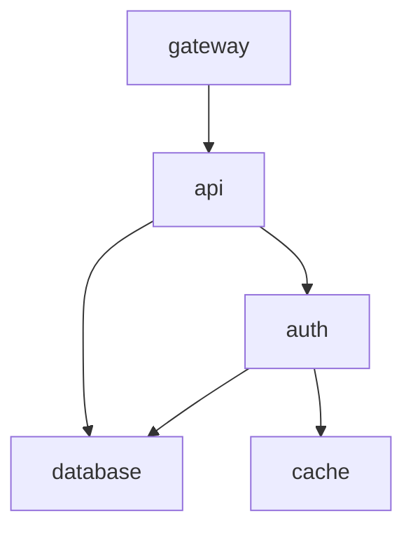

# Change Impact Forecaster

[](https://github.com/ursalaan/change-impact-forecaster/actions/workflows/ci.yml)
[](https://github.com/ursalaan/change-impact-forecaster/actions/workflows/release.yml)

Change Impact Forecaster is a backend service that evaluates the **risk and operational impact of production changes before they are deployed**.

It acts as a **change-management and SRE decision-support tool**, not an outage prediction system. Scoring is deterministic and fully explainable — every result shows exactly *why* a change is considered risky.

The goal is simple: make risk visible early so teams can ship safely.

---

## Why this exists

Most incidents aren’t caused by mysterious failures. They come from **predictable, high-risk changes**, such as:

- deployments out of hours or on weekends  
- weak or missing rollback plans  
- unclear service dependencies  
- large blast-radius releases shipped all at once  

These risks are usually obvious in hindsight, but rarely assessed consistently beforehand.

This project provides a **structured, repeatable way to evaluate change risk** before deployment.

---

## What the service does

The API exposes a single endpoint:

```
POST /assess
```

Given structured change metadata, the service returns:

- risk score (0–100)
- risk level (low / medium / high)
- dependency-aware blast radius
- contributing risk factors and weights
- mitigations and assumptions
- confidence level

All decisions are **rule-based and auditable**, not black-box predictions.

---

## Example assessment

### Request

```json
{
  "change_id": "CHG-1024",
  "title": "Deploy API service",
  "environment": "prod",
  "change_type": "deployment",
  "services_touched": ["api"],
  "rollback_quality": "partial",
  "monitoring_plan": "basic"
}
```

### Response (example)

```json
{
  "risk_score": 55,
  "risk_level": "medium",
  "confidence": "medium",
  "blast_radius": {
    "direct": ["api"],
    "indirect": ["gateway"]
  }
}
```

---

## How risk is assessed

Scoring is **deterministic and explainable**.

Signals include:

- environment (production vs non-production)
- change type
- deployment timing
- rollback quality
- monitoring strength
- number of services touched
- downstream dependencies

Each signal contributes a clear weight to the final score.  
Nothing is hidden or probabilistic.

---

## Dependency-aware blast radius

Dependencies are defined in:

```
data/dependencies.yaml
```

From this graph, the service calculates:

- directly affected services
- indirect downstream services

Unknown services are rejected early to avoid underestimating impact.

### Dependency graph



---

## Features

- FastAPI backend
- deterministic rule engine
- dependency graph blast-radius analysis
- structured logging
- request timing middleware
- strict input validation
- CLI for local assessments
- Docker image builds
- CI on every push
- CD on version tags

---

## Project structure

```
├── .github/
│   └── workflows/
│       ├── ci.yml
│       └── release.yml
├── .vscode/
│   └── settings.json
├── data/
│   └── dependencies.yaml
├── src/
│   └── cif/
│       ├── __init__.py
│       ├── api.py
│       ├── cli.py
│       ├── engine.py
│       ├── main.py
│       └── models.py
├── tests/
│   └── test_assess_contract.py
├── .gitignore
├── Dockerfile
├── Makefile
├── pyproject.toml
├── README.md
└── requirements.txt
```

---

## Running the service

### Using Make (recommended)

```bash
make run                      # start API locally
make test                     # run tests
make docker                   # build and run container
make assess FILE=change.json  # run assessment via CLI
```

### Manual commands

Run locally:

```bash
uvicorn cif.main:app --reload
```

Swagger docs:

```
http://127.0.0.1:8000/docs
```

Run Docker:

```bash
docker run -p 8000:8000 ghcr.io/ursalalan/change-impact-forecaster:latest
```

Run tests:

```bash
pytest
```

---

## CLI usage

You can assess a change without running the API:

```bash
python -m cif.cli assess change.json
```

Useful for scripting or quick checks.

---

## CI/CD

Continuous Integration runs on every push and pull request and executes the test suite automatically.

Continuous Deployment runs on version tags and builds a Docker image published to GitHub Container Registry.

Each release produces a reproducible, deployable artefact.

---

## Design principles

- deterministic over probabilistic  
- explainable over opaque  
- small and portable over over-engineered  
- configuration-driven dependency modelling  

---

## Status

Stable and ready for:

- portfolio demonstration
- technical interviews
- extension with historical data or ML-assisted scoring